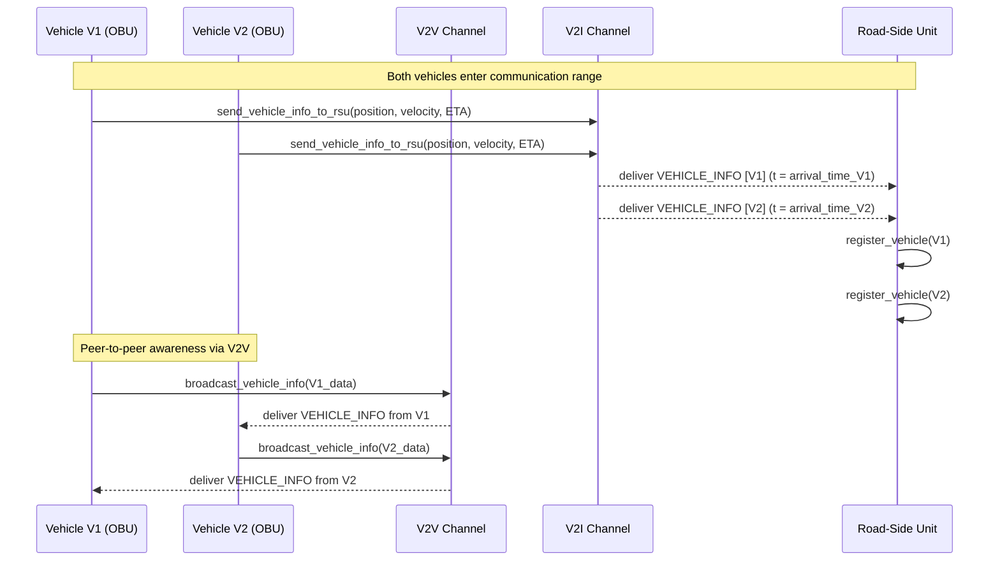
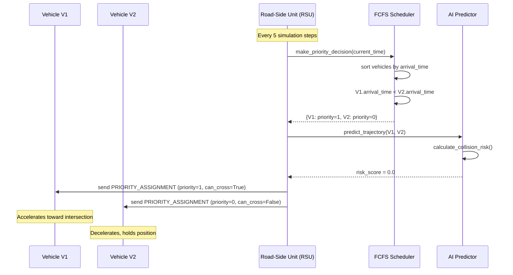
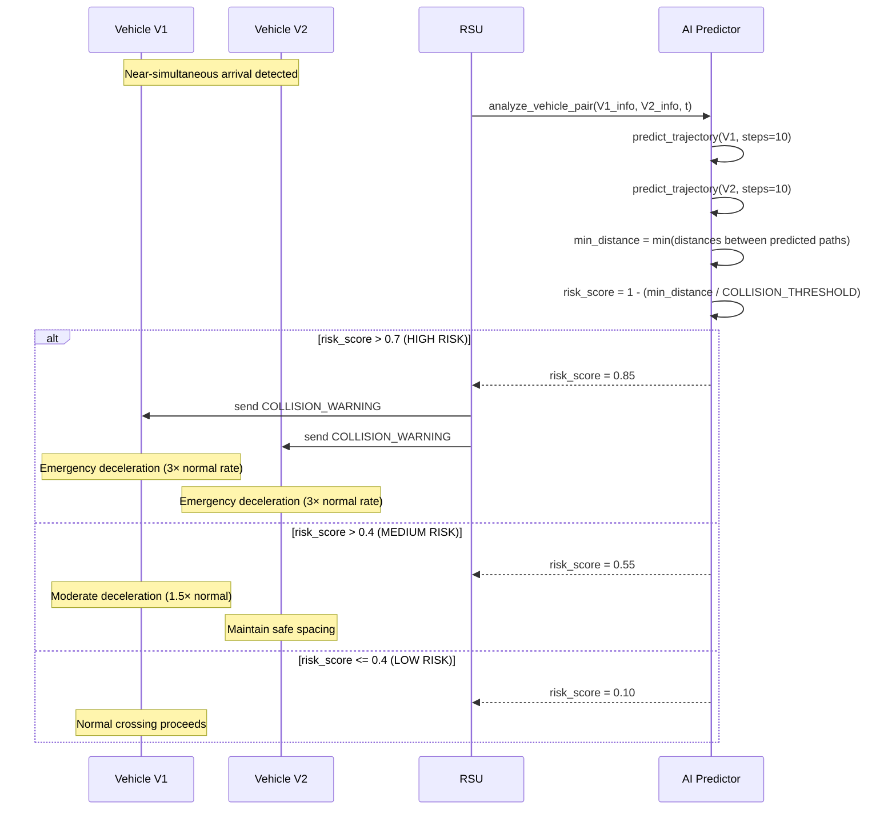
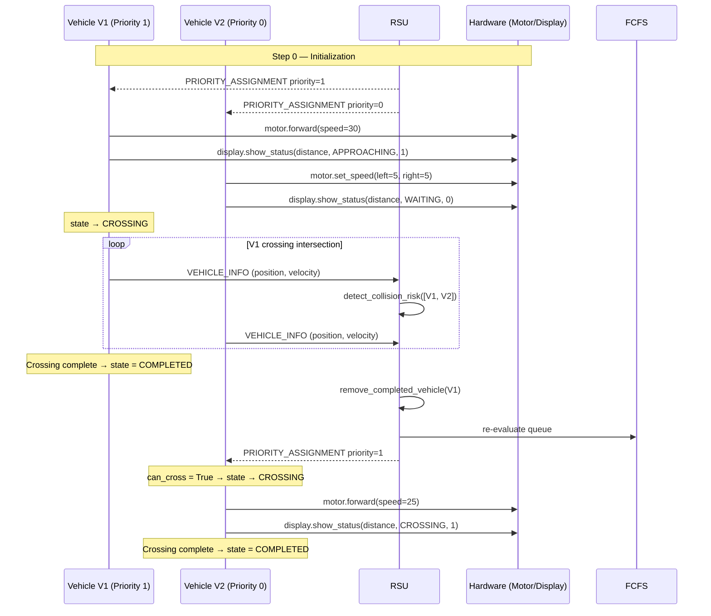
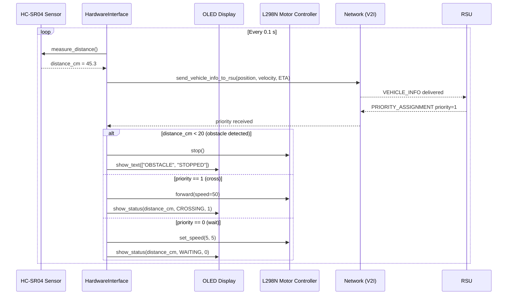
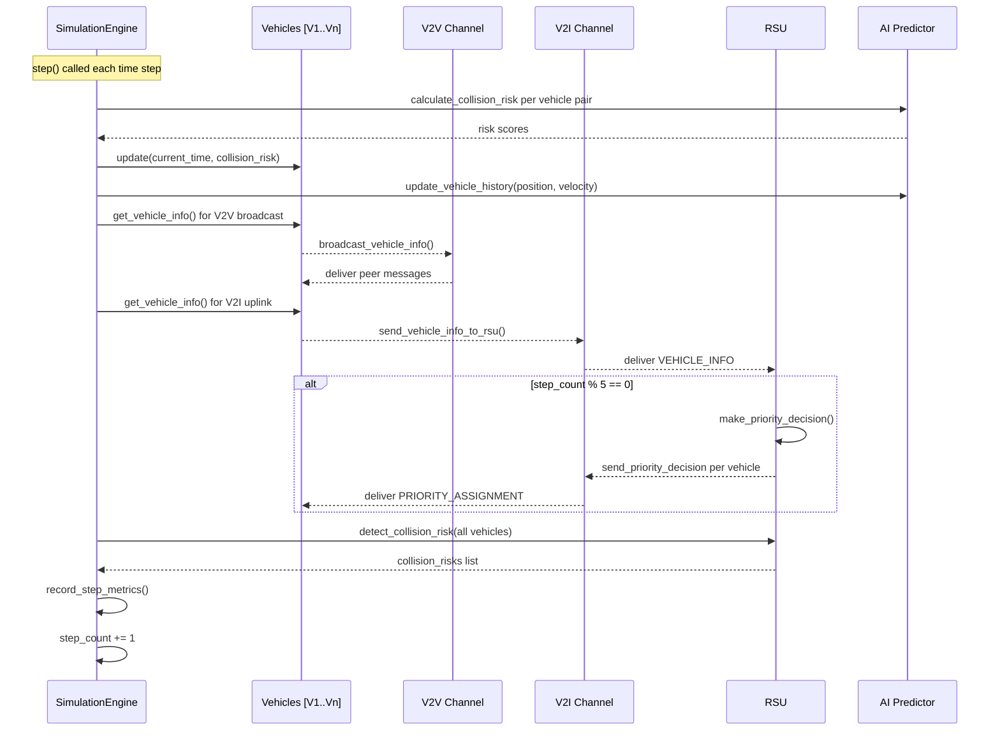

# Sequence Diagrams

All diagrams use [Mermaid](https://mermaid.js.org/) syntax — rendered automatically on GitHub.

---

## 1. Vehicle Registration and Initial Approach

---

## 2. FCFS Priority Decision and Assignment

---

## 3. Collision Risk Detection and Avoidance

---

## 4. Complete Intersection Crossing Sequence

---

## 5. Hardware Sensor → Motor Control Loop (Raspberry Pi)

---

## 6. Simulation Engine Step Pipeline

