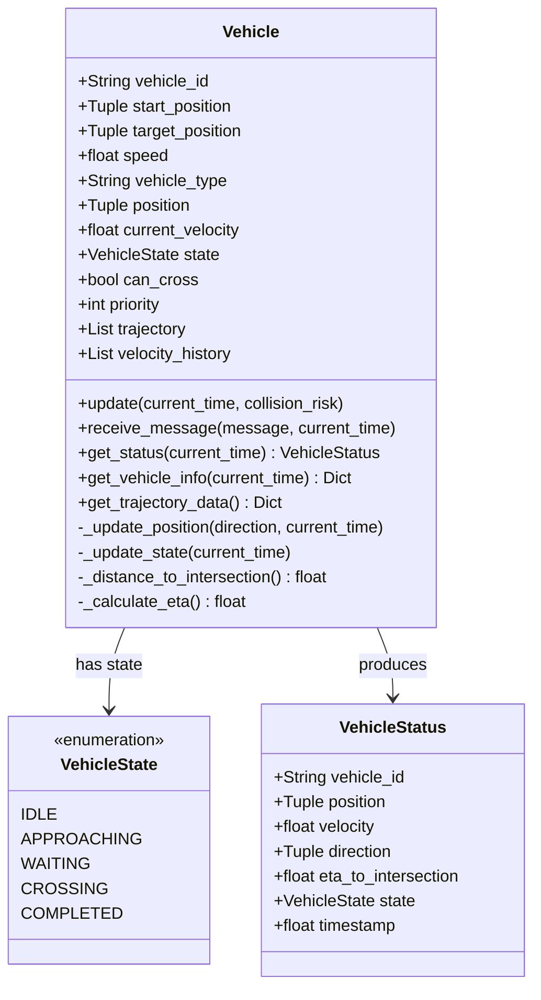
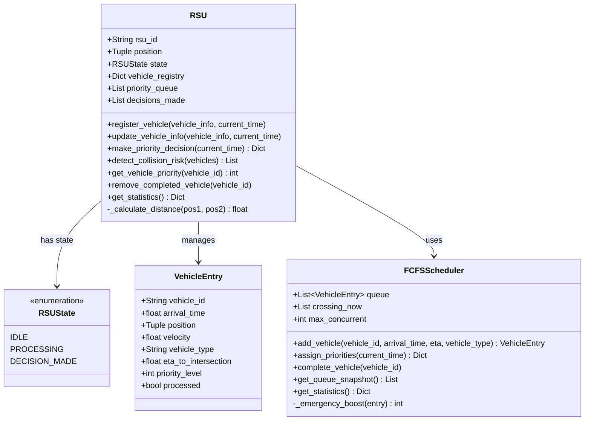
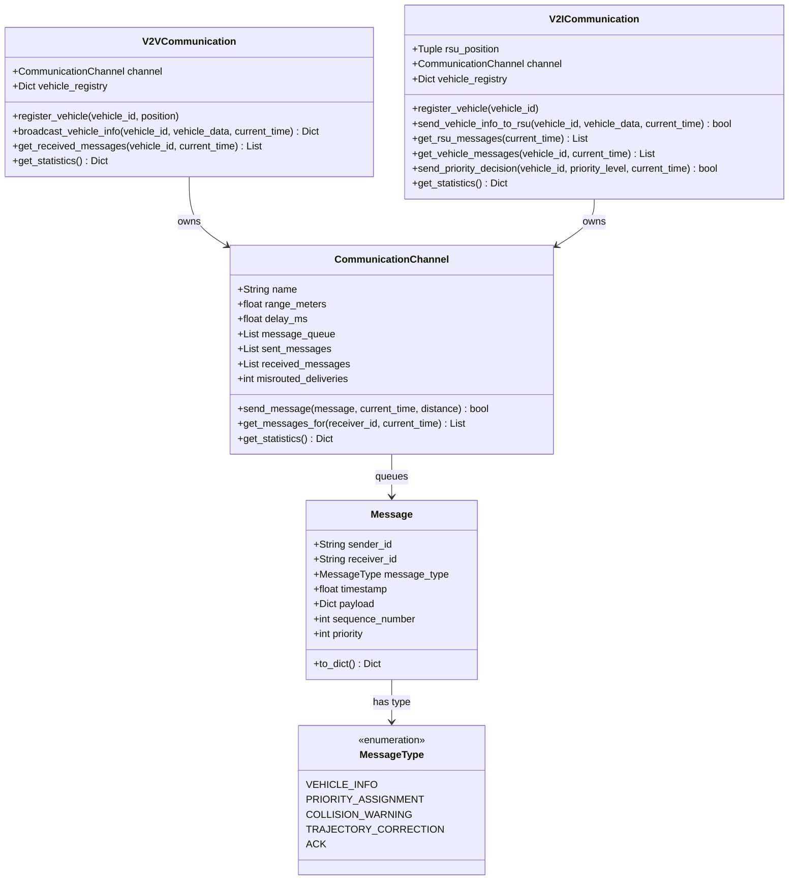
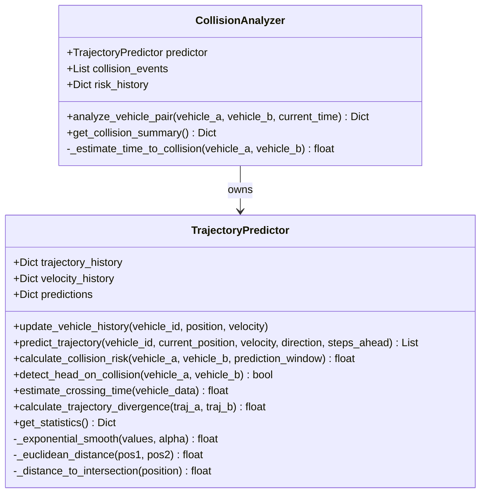
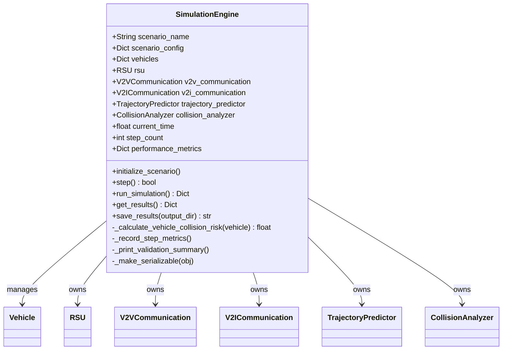
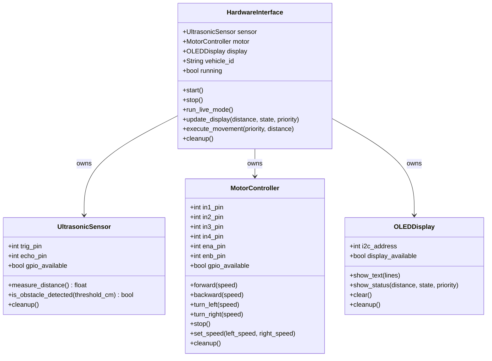
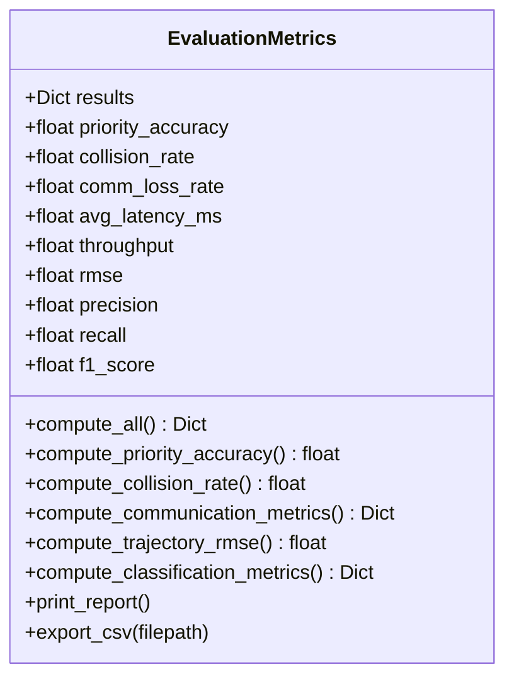

# UML Class Diagrams

All diagrams use [Mermaid](https://mermaid.js.org/) syntax — rendered automatically on GitHub.

---

## 1. Core Domain Classes

---

## 2. RSU and FCFS Classes

---

## 3. Communication Layer

---

## 4. AI Prediction Layer

---

## 5. Simulation Engine

---

## 6. Hardware Interface

---

## 7. Evaluation Module

